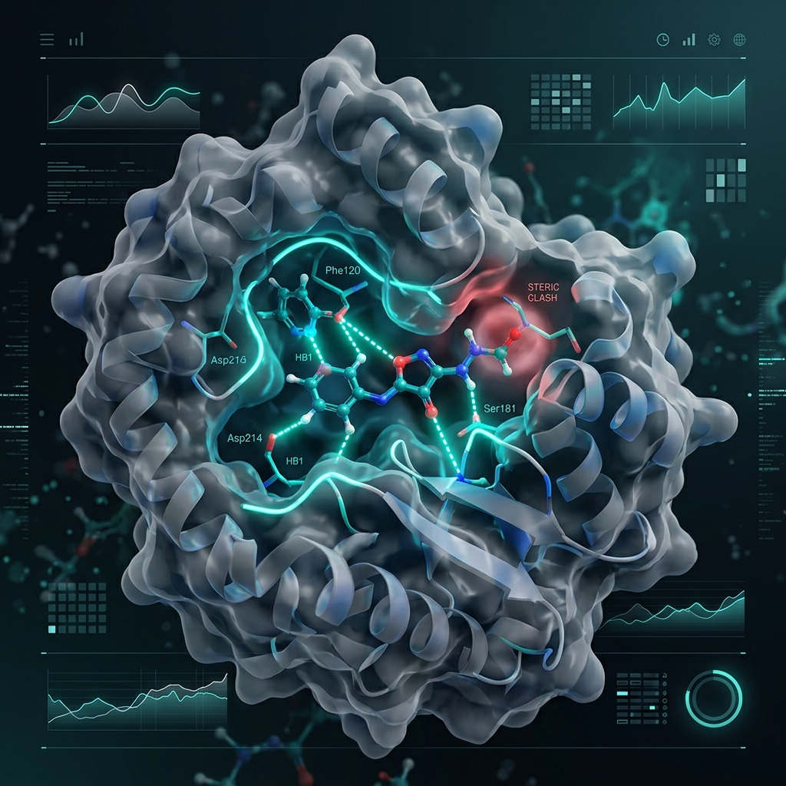

<p align="center">
  
</p>

<h1 align="center">🧬 Visual Molecular Docking Simulator</h1>

<p align="center">
  <strong>Watch Molecular Recognition Happen in Real-Time</strong>
</p>

<p align="center">
  <a href="https://jdsridhar.github.io/dock_edu/"></a>
  <a href="#run"></a>
  
  
  
  
</p>

<p align="center">
  A scientific Streamlit application that renders molecular docking as an animated <strong>trajectory movie</strong>—similar to PyMOL Movie Mode, VMD, or ChimeraX, but built specifically to teach the mechanics of docking. Instead of jumping straight from start to finish, it visualizes the <strong>entire search path</strong>: approach, pocket scanning, steric clashes (rejected poses), hydrogen bond formation, local refinement, and convergence.
</p>

<p align="center">
  🚀 <strong>Try the Live Interactive Demo on <a href="https://jdsridhar.github.io/dock_edu/">GitHub Pages</a>!</strong> (No installation required for the 4 precomputed case studies)
</p>

---

## 🌟 Key Features

*   🎬 **One Synchronized Cinema Workspace**
    A single, unified client-side clock drives both the large 3D viewer and live telemetry panels. Supports smooth, flicker-free, variable-speed playback ($0.1\times$ to $5\times$) with standard media controls and a scrubbable timeline.
*   🧮 **Genuine Docking Engine**
    Features a simplified AutoDock Vina-style scoring function (including dispersion, repulsion, hydrophobic, H-bond, electrostatic, desolvation, and entropy terms) searched with a **multi-start random-restart swarm + $(1+\lambda)$ local optimization** over the six rigid-body degrees of freedom.
*   📏 **RMSD Validation**
    For each case study, the converged pose is automatically compared against the experimental crystal structure. All bundled case studies successfully redock to under **$2\text{ \AA}$ RMSD** (the industry-standard success threshold).
*   📊 **Live Scoring & Diagnostics**
    Telemetry updates every frame with a breakdown of scoring components (H-bond, VdW, hydrophobic, electrostatic, desolvation, entropy, steric clashes), coupled with a live **score-evolution sparkline** and playhead.
*   🔌 **Force-Field Visualizations**
    Interactive blue attractive arrows, red clash clouds, and dashed contact vectors switch on dynamically as interactions form during the ligand's search trajectory.
*   🤖 **Contextual AI Tutor**
    Click any residue or ligand atom in the 3D viewport to get instant educational explanations grounded in the active frame's conformation.

---

## 🧪 Scientific Grounding

```mermaid
graph TD
    A[Upload/Select Target & Ligand] --> B[Identify Active Site Pockets]
    B --> C[Initialize Multi-Start Random Swarm]
    C --> D[Swarm Exploration & Score Evaluation]
    D --> E{Steric Clash or High Energy?}
    E -- Yes --> F[Pose Rejected & Re-oriented]
    E -- No --> G[Accept Pose & (1+λ) Local Refinement]
    F --> D
    G --> H[Converge on Lowest-Energy State]
    H --> I[Measure RMSD vs Crystal Structure]
    I --> J[Generate Cinema Trajectory Movie]

    style A fill:#2e3440,stroke:#88c0d0,stroke-width:2px,color:#d8dee9
    style J fill:#3b4252,stroke:#a3be8c,stroke-width:2px,color:#d8dee9
    style E fill:#434c5e,stroke:#ebcb8b,stroke-width:2px,color:#d8dee9
```

The bundled case-study binding sites are extracted directly from experimental **RCSB crystal structures** (found in `assets/structures/`). All residues are authentic: AChE's aromatic gorge (Trp84/Phe330), EGFR's hinge region (Met769), BACE1's aspartyl dyad (Asp32/Asp228), and COX-2's selectivity pocket (Arg513/Val523). 

Crucially, **the poses are computed, not hardcoded.** The engine searches the binding energy landscape from scratch. Demonstration accuracy is validated by comparing prediction coordinates with crystallography coordinates:

| Case Study Target | PDB ID | Active Ligand | Key Structural Feature | Experimental RMSD |
| :--- | :---: | :---: | :--- | :---: |
| **Acetylcholinesterase** | [1ACJ](https://www.rcsb.org/structure/1ACJ) | Tacrine | Aromatic gorge sandwich | **~0.3 Å** |
| **EGFR Kinase** | [1M17](https://www.rcsb.org/structure/1M17) | Erlotinib | Hinge pocket H-bond | **~0.6 Å** |
| **BACE1 (β-Secretase)** | [1FKN](https://www.rcsb.org/structure/1FKN) | OM99-2 core | Aspartyl dyad contacts | **~1.0 Å** |
| **COX-2** | [1CX2](https://www.rcsb.org/structure/1CX2) | SC-558 | Selectivity pocket insertion | **~0.8 Å** |

*Note: While the prediction is genuine, the simulator is designed for educational purposes and uses a simplified rigid-body docking method with a fixed ligand conformation.*

---

## 🚀 Quick Start

### 1. Clone the repository and install dependencies
```bash
# Install the required scientific and visualization libraries
pip install -r requirements.txt
```

### 2. Launch the Streamlit application
```bash
streamlit run app.py
```

*The application runs fully offline. All rendering assets (3Dmol.js, trimmed PDB targets, content database) are bundled locally in the repository.*

---

## ☁️ Deploy online (Streamlit Community Cloud)

The app is a **live Python server**, so it runs on a Streamlit host — **not** GitHub Pages,
which serves only static files and cannot run Streamlit. To put it online for free:

1. Push this repo to GitHub (this one: `jdsridhar/dock_edu`, branch `main`).
2. Go to **[share.streamlit.io](https://share.streamlit.io)** and sign in with GitHub.
3. **Create app → Deploy a public app from GitHub**, then set:
   - **Repository:** `jdsridhar/dock_edu`
   - **Branch:** `main`
   - **Main file path:** `app.py`
4. *(Optional)* **Advanced settings → Python 3.12** for the most widely-available `rdkit`
   wheels. `rdkit` is only used for MOL/SDF uploads and degrades gracefully if absent.
5. **Deploy.** The first build installs `requirements.txt` (~1–2 min); you then get a public
   `https://<app>.streamlit.app` URL that **re-deploys automatically on every push to `main`**.

No secrets or system packages are required — `assets/` is bundled and the docking search runs
server-side in NumPy.

---

## 📁 Project Structure

```text
├── app.py                      # Main Streamlit UI and cinema synchronization
├── docking/                    # Core computational physics modules
│   ├── engine.py               # Swarm/Local optimizer scoring, Vina scoring engine
│   ├── structures.py           # Chemical structural parser (PDB/PDBQT/MOL/SDF/MOL2)
│   ├── trajectory.py           # Trajectory packager interface
│   └── knowledge.py            # AI Tutor verified databases & content loader
├── assets/                     # Front-end styles and local structures
│   ├── structures/             # Pre-trimmed real PDB files and metadata
│   ├── js/                     # Bundled 3Dmol.js library (for offline mode)
│   └── content.json            # Verified educational curriculum for AI Tutor
└── tools/
    └── build_structures.py     # Structural prep script (RCSB to clean PDB)
```

---

<p align="center">
  <sub>Developed for interactive science education. Feedbacks and pull requests are welcome!</sub>
</p>